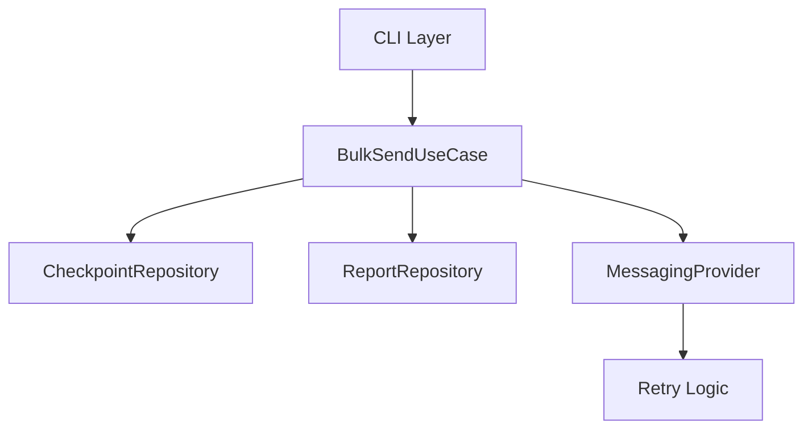

# 🚀 Professional WhatsApp Bulk Sender (Resilient Edition)

A senior-level, professionally architected WhatsApp bulk messaging tool built with **Node.js (TypeScript)**. 

---

## 🏗 Architecture & Reliability Features

This project implements a **Layered Architecture** with high-resilience features:

- **Exponential Backoff Retry**: Automatically retry message delivery on network failures (2s, 4s, 8s...).
- **Checkpoint & Resume**: Progress is saved per campaign. If interrupted, the app resumes from the last successful message.
- **Reporting System**: Detailed `success.json` and `failed.json` reports are generated after each campaign.
- **Error Classification**: Distinguishes between account issues, network problems, and invalid numbers.



---

## ✅ Subcommands

- `validate`: Check if your CSV/JSON file is valid.
- `preview`: Dry-run simulation (Check templates and delays).
- `send`: Connects and executes the campaign with full reliability support.
  - `--no-resume`: Start a new campaign even if a checkpoint exists.

---

## 🚀 Getting Started

### 1. Requirements
- Node.js >= 18
- WhatsApp account

### 2. Setup
```bash
npm install && cp .env.example .env && npm run build
```

### 3. Usage
```bash
# Start sending (will auto-resume if interrupted)
npm run start -- send contacts.example.csv --message "Hi {{name}}!"
```

---

## 🧪 Testing

Run the reliability tests:
```bash
npm test
```

---

## 🐳 Docker
```bash
docker-compose up --build
```

---

## 👔 Author
**Cristiano** - [GitHub](https://github.com/CristianoBG)

> [!CAUTION]
> **Responsible Use**: Bulk messaging without consent violates WhatsApp Terms of Service and can result in account bans. Use with caution.
